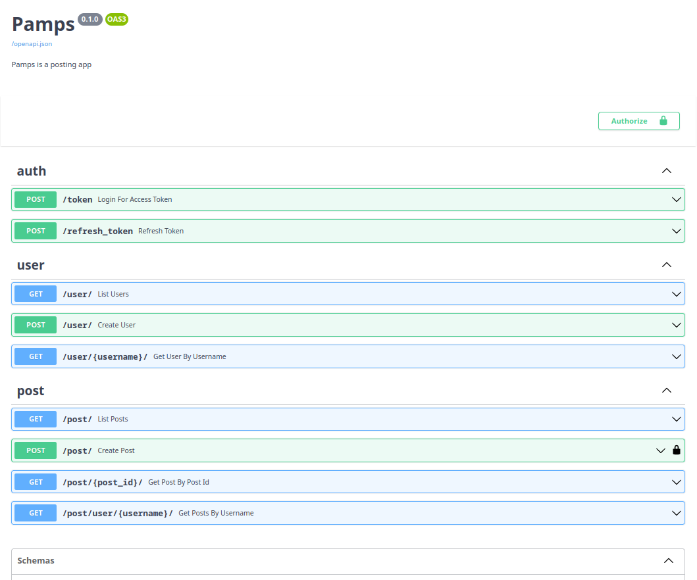

# Introduction


This was a workshop by Linxtips, taught by instructor Bruno Rocha, software engineer at Red Hat.
In this workshop, we learn to create APIs using Fastapi and Python, from the creation of the project structure, data modeling, dependency injection, working with containers from the beginning.




## The project

We created a Twitter style microblog, a simple but with sufficient functionality to exercise the main features of an API.
We focus on backend, ie the API only, the project name is "Pamps" a name
random for a fictional social network.


## Functionalities

### Users
- Registration of new users
- User authentication
- Follow other users
- Profile with bio and listing of posts, followers and followed

### Posts
- New Post Creation
- Post editing
- Post Removal
- General Post Listing (Home)
- Listing of Fourth Posts (Timeline)
- Likes in Posts
- Post may be an answer to another post

## Requirements

- Computer with Python 3.10
- Docker & docker compose
- Or https://gitpod.io for an online environment
- A code editor like VSCode, Sublime, Vim, Micro

> 
>important: The commands presented will be executed in a Linux terminal, if you are on >Windows I recommend using WSL, a virtual machine or a Linux container, or adapting the >necessary commands yourself.
>


## Installation

### In the gitpod terminal run
```
docker compose up
```

### Open another terminal by clicking on the + and run::
```
docker compose exec api alembic upgrade head
```
### The API will now be served on port 8000 of your gitpod, example:
> https://8000-seuuser-fastapiwork-random.random.gitpod.io/docs

### Also try it in the gitpod terminal:
```
pip install -e .
docker compose exec api pamps --help
```
 
>
> WARNING!!! If docker compose doesn't work, try adding a - as in docker-compose


